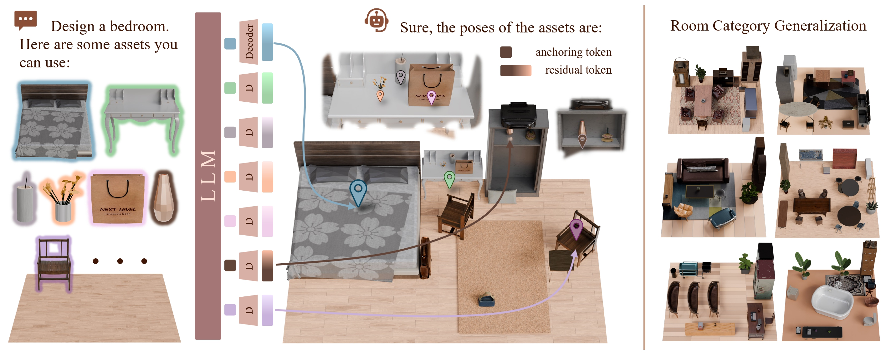

# NaLA: A 3D Native LLM Layout Agent for High-quality 3D Scene Generation (ECCV 2026)

  <a href="https://adamcwan.github.io/NaLA/"><strong>Project Page</strong></a> |
  <a href="[https://arxiv.org](http://arxiv.org/abs/2606.29395)/"><strong>arXiv</strong></a> |
  <a href="https://github.com/adamcwan/NaLA-code"><strong>Code</strong></a>

  

---

## Introduction

This is the official implementation of **NaLA**, a 3D-native LLM layout agent for high-quality 3D scene generation. NaLA encodes point clouds of scenes and assets as native 3D tokens and generating placements through a coarse-to-fine pose decoding strategy, enabling end-to-end reasoning over 3D geometry for physically and semantically plausible layouts.

---

## Code Release

🚧 **Code is coming soon.** We are currently cleaning up and organizing the codebase for public release. Stay tuned!
